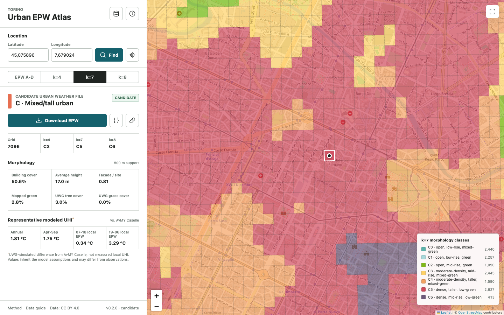

# Torino Urban EPW Atlas

[](#scientific-status)
[](LICENSE)
[](DATA_LICENSE.md)

The Torino Urban EPW Atlas connects citywide urban morphology to a compact set of
Urban Weather Generator (UWG) weather files. A user can select a location on the
map or enter latitude and longitude to retrieve its morphology classes, local
500 m-support metrics, quality flags, and assigned candidate EPW.

**Authors:** Ali JahaniRahaei and Giacomo Chiesa. See [AUTHORS.md](AUTHORS.md)
and the machine-readable [CITATION.cff](CITATION.cff).

- **Web atlas:** https://alijahanirahaei.github.io/torino-urban-epw-atlas/
- **Source repository:** https://github.com/alijahanirahaei/torino-urban-epw-atlas



## Research Product

The release translates 12,997 regularly sampled Torino locations into:

- candidate morphology classifications for `k=4`, `k=7`, and `k=8`;
- a retained seven-class morphology map based on robust-scaled k-medoids;
- four reduced weather-output categories, A-D;
- four annual UWG-generated EPWs using AvMY Caselle as common forcing;
- a 100 m spatial assignment layer with morphology calculated over overlapping
  500 x 500 m supports; and
- a browser and command-line coordinate lookup.

The k=4 morphology solution and the four EPW categories are different products.
The EPW categories were obtained by reducing the outputs of the seven morphology
medoids: A represents C0+C1, B represents C2, C represents C3+C4+C5, and D retains
C6.

**v0.2.0 updates the earlier prototype.** B and C have new representatives;
2,445 C3 assignments move from B to C, including Alenia. Morphology k=7 is
unchanged. The atlas withholds location EPW recommendations for 20 high-density
C6 supports and 135 incomplete assignments. These are counts of overlapping
sampling supports, not independent neighborhoods.

## Open The Tool

### Published Website

Visitors do not install anything. Open the
[Torino Urban EPW Atlas](https://alijahanirahaei.github.io/torino-urban-epw-atlas/),
click the map or enter latitude and longitude, inspect the morphology and QA
fields, and use the download controls for the assigned EPW or exact UWG JSON
configuration.

### Local Browser

The atlas is a static site and does not require a database or backend. It should
nevertheless be served over HTTP because browsers may block the local GeoJSON
requests when `index.html` is opened directly as a file. From the repository root:

```bash
python3 -m http.server 8000
```

Open `http://localhost:8000`. Stop the server with `Ctrl+C`.

### Command-Line Lookup

The command-line lookup returns the same assignment:

```bash
python3 scripts/lookup.py 45.0757395 7.6785426
```

This lookup uses only the Python standard library. GIS users can instead open
`data/spatial/torino_urban_morphology_epw_atlas.gpkg` directly in QGIS, ArcGIS
Pro, Python, or another GeoPackage-compatible application.

## Repository Automation

The public repository includes two GitHub Actions workflows. Pushes and pull
requests run release validation and lookup tests. Pushes to `main`, or a manual
workflow dispatch, validate the release before deploying the static atlas with
GitHub Pages. Maintainers of forks can enable Pages with **GitHub Actions** as the
publishing source. No deployment credentials are stored in this repository.

See the [complete repository guide](docs/repository-guide.md) for public use,
maintenance, and file-level documentation.

## Weather Library

| Category | Morphology interpretation | k=7 source classes | Representative grid | Annual modeled UHI* |
|---|---|---|---:|---:|
| A | Open low-rise | C0+C1 | 3788 | 1.69 degC |
| B | Tree-rich mid-rise | C2 | 10026 | 1.75 degC |
| C | Mixed/tall urban | C3+C4+C5 | 5210 | 1.81 degC |
| D | Large-footprint | C6 | 1524 | 1.95 degC |

\* UHI values are UWG-simulated annual mean differences from AvMY Caselle under
the accepted common configuration. They are not measured local UHI values or
observed temperature corrections. They inherit the assumptions and limitations
of the model and may differ from observations at a queried location.

## Repository Contents

| Path | Contents |
|---|---|
| `index.html`, `assets/`, `web/data/` | Browser lookup application |
| `data/spatial/*.gpkg` | Canonical EPSG:3003 GeoPackage with grid, medoids, and boundary |
| `data/spatial/*.zip` | WGS84 GeoJSON and EPSG:3003 shapefile distributions |
| `data/tables/grid_assignments.csv` | Complete non-spatial assignment and morphology table |
| `data/tables/cluster_*` | Medoids, profiles, and k=2-12 selection diagnostics |
| `data/epw/` | Four annual candidate EPWs |
| `data/configs/` | Exact UWG JSON configurations for A-D |
| `data/figures/` | k=4/7/8 maps, profiles, diagnostics, and method figures |
| `scripts/build_release.py` | Rebuilds the public package from validated source artifacts |
| `scripts/validate_release.py` | Validates geometry, tables, EPWs, hashes, configs, and known lookups |
| `checksums.sha256` | SHA-256 hashes for every distributed data and web-data file |

See the [data guide](docs/data-guide.md), [method summary](docs/methodology.md),
and [validation notes](docs/validation.md) for details. The
[complete file catalog](docs/repository-guide.md#complete-file-catalog) explains
every file in the repository and identifies which files visitors, researchers,
and maintainers actually need.

## Rebuild And Validate

Install the maintainer dependencies:

```bash
python3 -m pip install -r requirements.txt
python3 scripts/build_release.py
python3 scripts/reproduce_reduction.py --check
python3 scripts/validate_release.py
python3 -m unittest discover -s tests -v
```

The builder uses only supplied `research/inputs/` artifacts and existing hashed
EPWs, not the authors' private workspace. It reproduces fixed-classifier
assignments and exports, not a fresh GIS extraction or clustering fit. See the
[reproducibility guide](research/README.md) for the exact boundary of this claim,
the seven-medoid reduction and the reusable UWG runner.

## Scientific Status

Version 0.2.0 is a **candidate research release with explicit applicability limits**.

- Seven-medoid reduction and 105 stratified non-medoid supports support small
  typical temperature-compression errors, but stress testing found a dense
  industrial failure domain. Four files are a fidelity/complexity compromise,
  not a uniquely necessary minimum for Torino.
- For k7=C6 and building fraction >= 0.7951808541001185, location downloads are
  withheld. Raw category D remains available for expert inspection, not as an
  approved recommendation for those locations. Below-threshold membership is
  not an accuracy guarantee.
- Corrected canopy fields use the archived scaler and medoid identities. Two
  k4 and three k8 labels change, no k7 labels change; archived inputs are retained.
- Library EPWs closely reproduce their assigned fixed-template UWG outputs, but
  absolute agreement with measured urban stations is location dependent.
- Supports crossing the municipal boundary are marked provisional because no
  external GIS halo was used.
- UWG 5.3.4 did not produce morphology-dependent humidity-ratio changes in this
  workflow. The library should not be interpreted as a modeled urban dry-island
  product.
- The classifications were developed for UWG-relevant thermal morphology. They
  are useful spatial strata for other studies, but are not automatically optimal
  for wind, pollution, radiation, hydrology, or outdoor-comfort applications.

The atlas returns a **morphology-matched candidate EPW**, not a certified or
observationally exact local weather file.

Public EPWs use standard one-decimal serialization. Three-decimal diagnostic
temperature series are supplied for research reproduction; extra digits are not
extra meteorological accuracy. The four-representative maximum medoid RMSE is
0.05820 C at one decimal and 0.04019 C at three decimals.

## Citation

Citation metadata are provided in `CITATION.cff`. The companion journal citation
and archived release DOI will be added when they become publicly available.

The atlas itself should be credited to **Ali JahaniRahaei and Giacomo Chiesa**.

The source Torino weather dataset should also be cited:

> JahaniRahaei, A., Milelli, M., & Chiesa, G. (2025). Urban weather dataset for
> building energy simulations: Data collection and EPW file generation for
> Torino, Italy (2014-2023). *Data in Brief, 61*, 111708.
> https://doi.org/10.1016/j.dib.2025.111708

Dataset: https://doi.org/10.5281/zenodo.14905721

## Licenses And Attribution

- Repository code: [MIT License](LICENSE).
- Derived spatial data, figures, configurations, and EPWs: [CC BY 4.0](DATA_LICENSE.md).
- Source cartography: Citta di Torino Geoportal, CC BY 4.0; see the municipal
  [license terms](https://www.comune.torino.it/note-legali).
- Source AvMY Caselle EPW: Torino-EPW, CC BY 4.0, DOI
  `10.5281/zenodo.14905721`.
- Basemap tiles: OpenStreetMap contributors, ODbL.

See [third-party notices](THIRD_PARTY_NOTICES.md) for bundled web libraries and
map-service attribution.

In practical terms, CC BY 4.0 permits the covered research outputs to be shared
and adapted for any purpose, including commercially, provided appropriate credit
is given, the license is linked, and changes are indicated. A ready-to-use
attribution statement is provided in [DATA_LICENSE.md](DATA_LICENSE.md).
